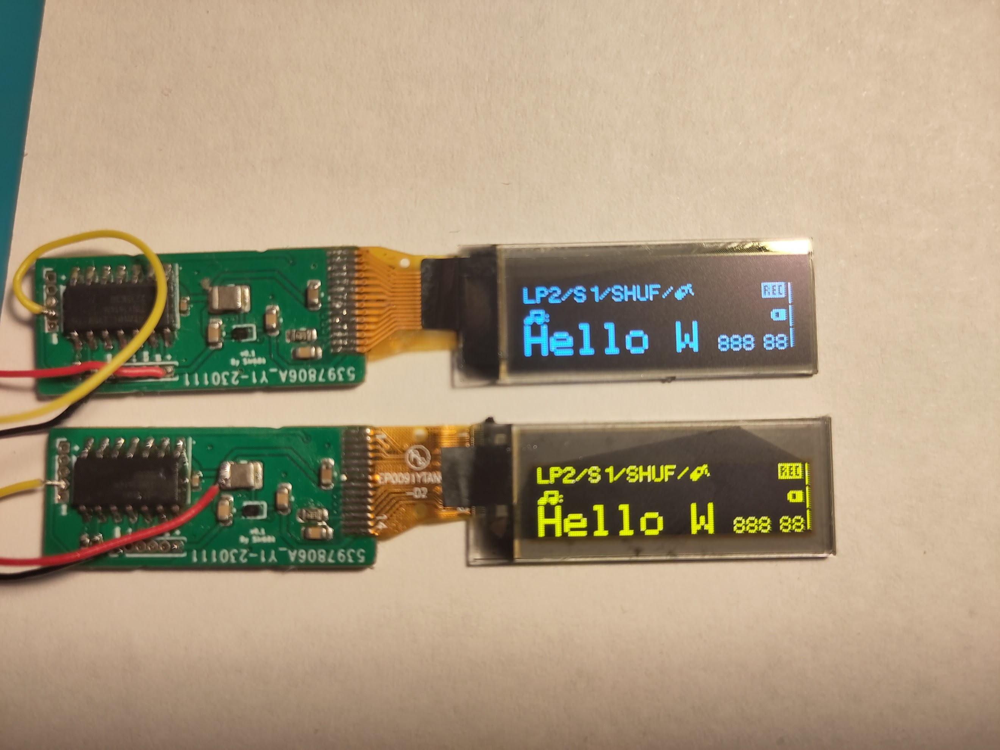
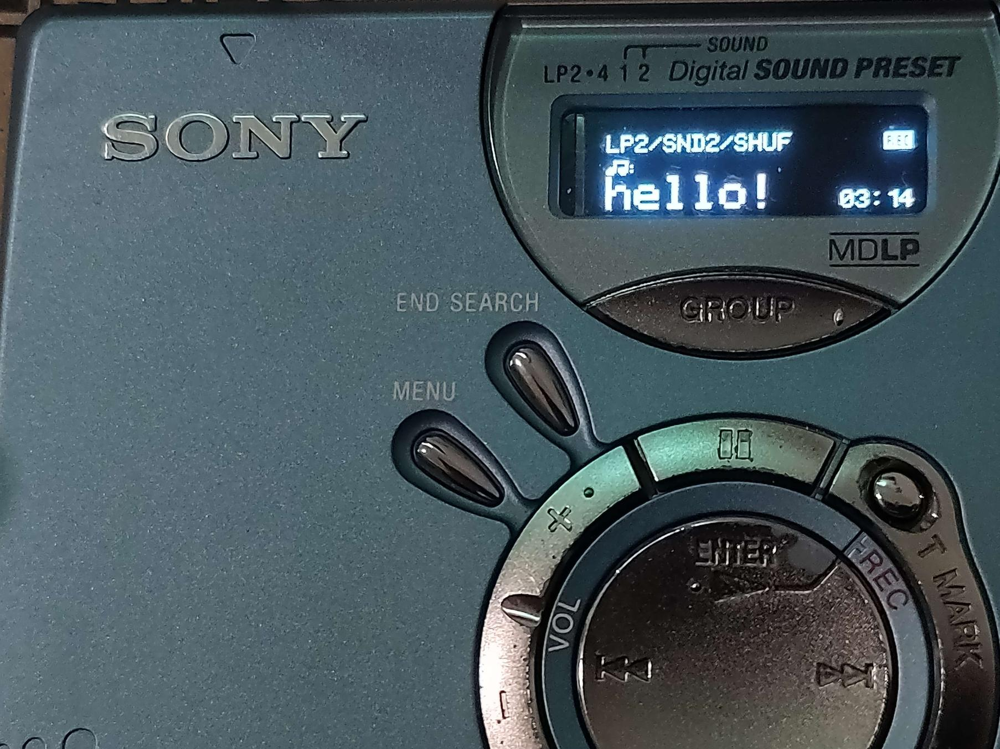
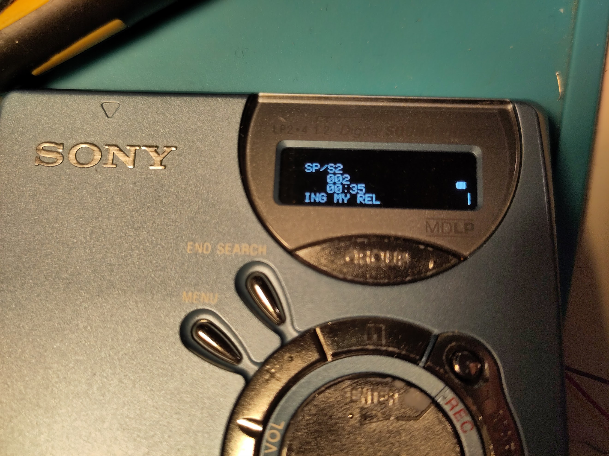
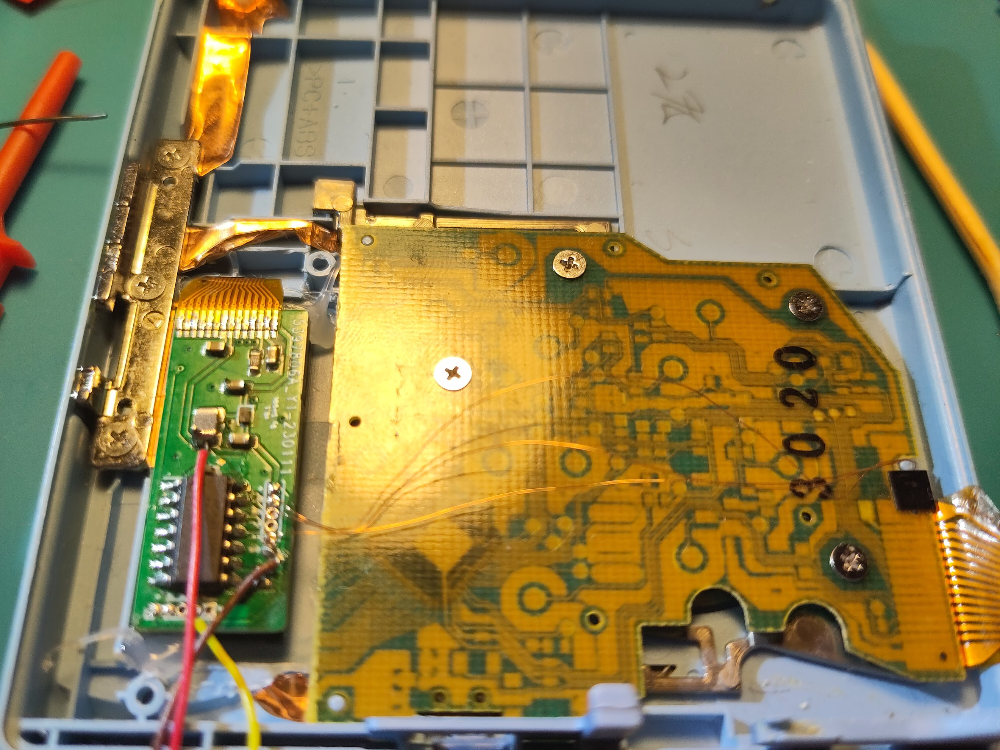
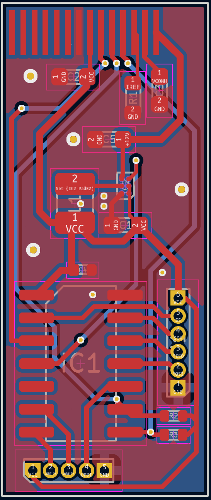

# md-classic-display

This project is a modern replacement for classic LCD displays in Sony MiniDisc portables. 

The protocol is documented here: https://github.com/MiniDisc-wiki/md-firmware/wiki/LCD-SPI-protocol-(NetMD-devices)

Confirmed to work with: MZ-N510, MZ-N520, MZ-N505. Should work on all Sony NetMD devices (non-himd), and most likely will work on older devices (the MZ-R700 uses the exact samedisplay protocol, I only haven't tested it).

